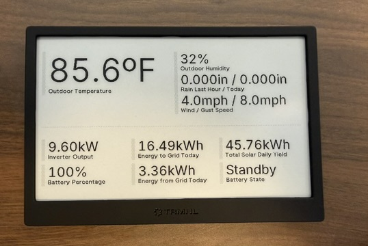

# Home Assistant -> TRMNL with Swift/Vapor

This project's goals:
1. Take all of the data I collect about my house (weather, solar, etc) in Home Assistant and bundle it up nicely to hand over to display on my [trmnl](https://usetrmnl.com).
2. Provide a platform for me to experiment with [Vapor](https://vapor.codes). I write a ton of Swift code and prefer it to other languages, but I have never done any server work in Swift, only Python and Javascript, and this project is the perfect test bed for Vapor.
3. Make deployments and updates automatic using GitHub Actions to build a Docker image of this project, then use Rancher to automatically deploy the update to my home kubernetes cloud.



This trmnl display is generated from the json returned by this project which takes the form:

```json
{
  "battery_percentage": "100%",
  "battery_state": "Standby",
  "inverter_output": "9.53kW",
  "mainsfromgrid_energy_today": "3.36kWh",
  "mainstogrid_energy_today": "17.06kWh",
  "outdoor_humidity": "31%",
  "outdoor_temperature": "86.0ºF",
  "rain_last_hour": "0.000in",
  "rain_today": "0.000in",
  "total_solar_daily_yield": "46.73kWh",
  "wind_gust_strength": "9.0mph",
  "wind_speed": "4.0mph"
}
```


### Usage

If anyone else would like to use this project, consider this a template to fork the repo and customize for your setup. You could deploy this server directly, but none of my sensor values in HA will match anything that you have.

The first thing to customize is the environment variables for Home Assistant. Those are HA_URL and HA_BEARER for the url to your HA server and a jwt auth token for API access to the server respectively. Locally, create a `.env` file to store those, for deployments I store them in a Secret on kubernetes.

Next, customize the HA sensors, as well as the properties to export to your trmnl. Those are all in `Sources/HaTrmnlVapor/trmnl.swift`.

